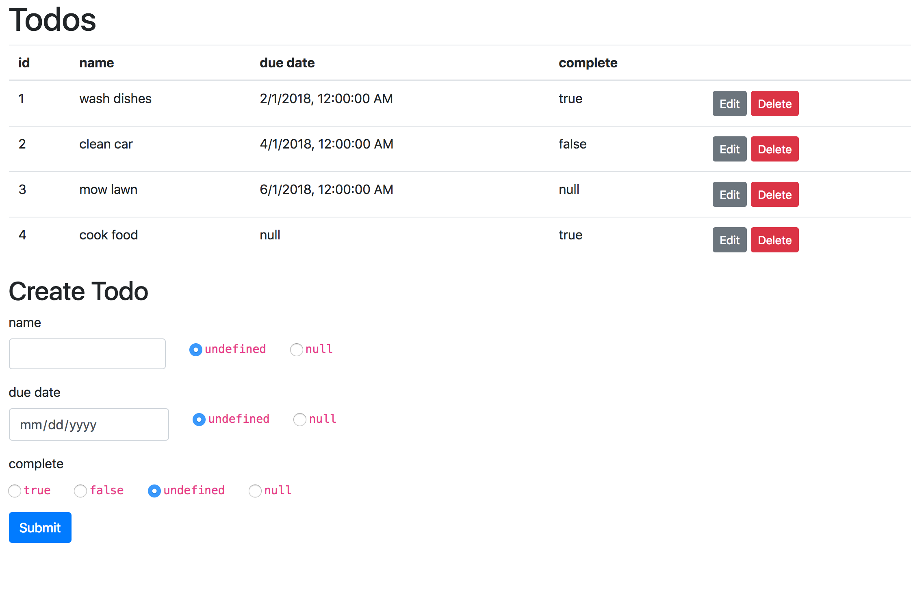

# can-crud

[](https://travis-ci.org/canjs/can-crud) [](https://greenkeeper.io/)

Quickly create CRUD scaffolding for [CanJS](http://canjs.com)!

Create a model like:

```js
import {DefineMap, DefineList, realtimeRestModel} from "can";

var Todo = DefineMap.extend("Todo",{
	id: {identity: true, type: "number"},
	name: "string",
	dueDate: "date",
	complete: "boolean"
});
var TodoList = DefineList.extend("TodoList",{
	"#": Todo
});

realtimeRestModel({
	Map: Todo,
	List: TodoList,
	url: "/api/todos/{id}"
});
```

Pass that model to `<can-crud>` in your app:

```js
import {Component} from "can";
import "can-crud";

Component.extend({
  tag: "my-app",
  view: `<can-crud Type:from="this.Todo"/>`,
  ViewModel: {
    Todo: { deafult: ()=> Todo }
  }
})
```

You'll see something like this:



You can now view, edit, delete, and create records of your type!

> NOTE: Include boostrap to style the components. Add the following to `<head>`:
> ```
> <link href="./ignore/bootstrap.min.css" rel="stylesheet">
> <meta charset="utf-8">
> <meta name="viewport" content="width=device-width, initial-scale=1, shrink-to-fit=no">
> ```

You can use the parts of this component on their own:

### can-crud

### can-create

### can-edit 

### can-list 

### can-crud-modal
